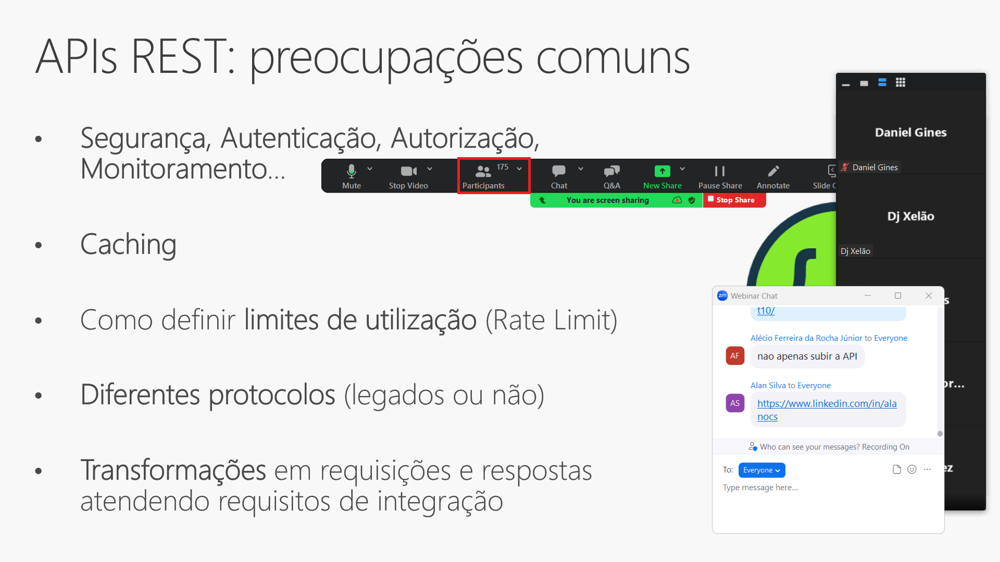
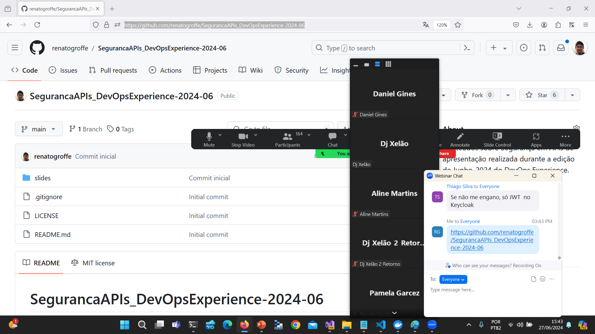
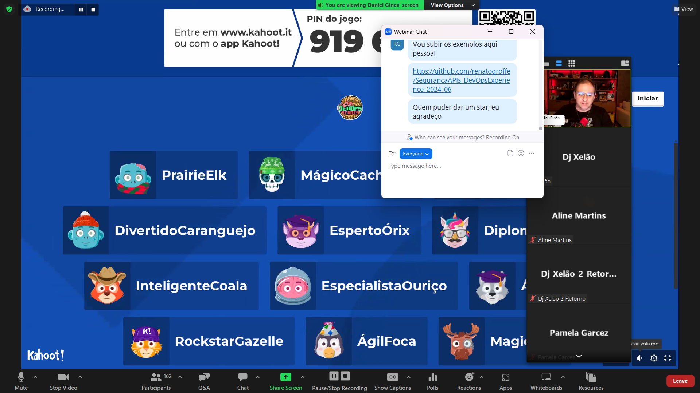
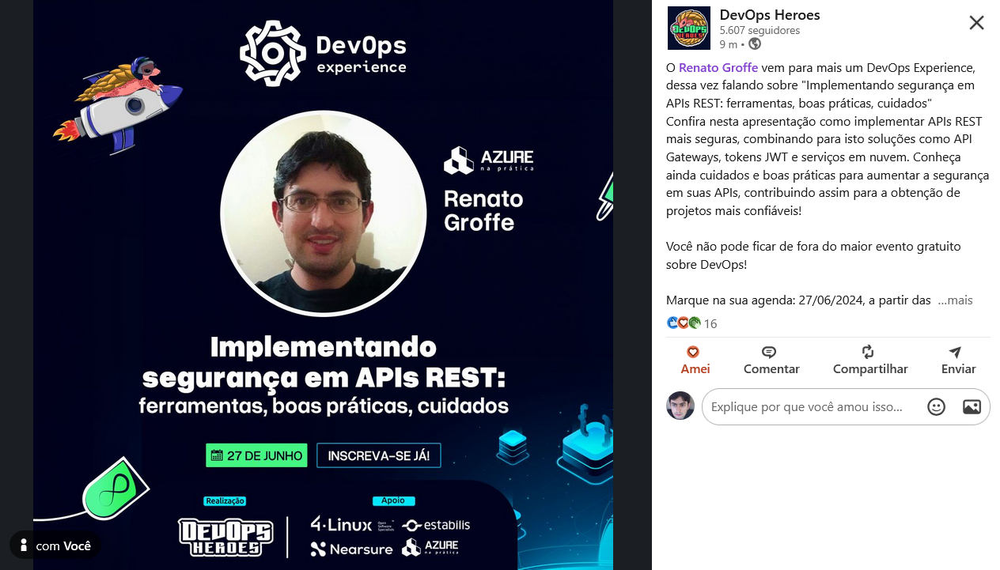

# SegurancaAPIs_DevOpsExperience-2024-06
Conteúdos sobre Segurança em APIs de apresentação realizada durante a edição de Junho-2024 do DevOps Experience.

---

Título da apresentação: **Implementando segurança em APIs REST: ferramentas, boas práticas, cuidados...**

Data: **27/06/2025 (quinta-feira)**

Tipo do evento: **Online**

Ferramenta de transmissão: **Zoom**

Tecnologias e tópicos abordados: **REST APIs, JWT, JSON Web Encryption (JWE), Developer Security, Cybersecurity, .NET, ASP.NET Core, Azure API Management (APIM), Microsoft Entra ID, Azure AD B2C...**

Número de participantes: **175 pessoas (pico de audiência ao longo da live)**

Link do evento: [**LinkedIn**](https://wwww.linkedin.com/posts/devopsheroes_o-renato-groffe-vem-para-mais-um-devops-experience-activity-7207030396184670208-gmip/)

Deixo aqui meus agradecimentos ao **Daniel Ginês** e à **Aline Martins** por todo o apoio para que eu partipasse como palestrante de mais uma edição do **DevOps Experience**.

---

